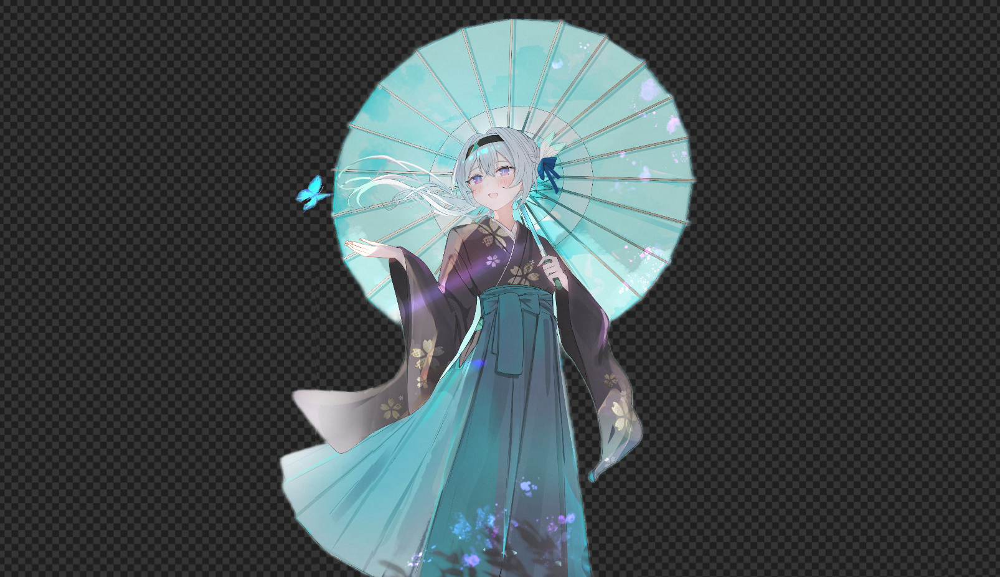

<h1 align="center">
  <br/>
  LumaCut
</h1>

<p align="center">
  <strong>Studio-grade AI background removal — entirely in your browser.</strong><br/>
  Zero uploads. Zero servers. Zero cost per image. Just unmistakable clarity.
</p>

<p align="center">
  
  
  
  
  
</p>

---

## ✨ What is LumaCut?

LumaCut is a **zero-server, zero-latency AI background removal tool** that runs the entire inference pipeline directly inside your web browser using WebAssembly and ONNX Runtime Web.

Most background-removal tools upload your images to a cloud server, charge per API call, and introduce latency and privacy risks. LumaCut flips that model completely — the AI model is downloaded once to your device (~40 MB, cached forever), and every subsequent cut happens **locally, instantly, and for free**.

---

## 🖼️ Before & After

### Demo 1 — Anime illustration

| Before | After |
|:---:|:---:|
|  |  |
| Original `.jpg` — full background intact | Transparent `.png` — subject isolated with hair-fine edge precision |

### Demo 2 — Real-world photo (Lewis Hamilton)

| Before | After |
|:---:|:---:|
|  |  |
| Original `.jpg` — complex background with crowd and environment | Transparent `.png` — subject perfectly separated, even across complex edges |

> Both cuts were made using LumaCut in a standard browser window — no server, no API key, no upload.

---

## 🚀 Features

### 🧠 In-Browser WASM Inference
The AI model (`@imgly/background-removal` powered by ONNX Runtime Web) runs entirely inside a WebWorker in your browser. Your images **never leave your device** — not even for a millisecond. This is privacy by architecture, not by policy.

### 📦 Batch Processing
Drop an entire folder of images at once. LumaCut accepts **multiple files simultaneously** and processes them sequentially in a FIFO queue. A real-time "Processing 2 of 5…" indicator keeps you informed while the queue drains.

### 📥 Individual & ZIP Download
- Each processed image has its own **Download PNG** button — one click, instant save.
- When a batch finishes, a **"Download All as ZIP"** button appears, bundling every transparent PNG into a single archive using `jszip` — generated entirely in memory, no server required.

### 🕘 Persistent Session History
Every successful cut is automatically saved to **IndexedDB** via `localforage`. Your session history survives page reloads, browser restarts, and even device reboots (as long as you're on the same browser). The history card in the Ledger section shows your 5 most recent before/after pairs with relative timestamps.

### 📊 Model Download Overlay
The very first time you process an image, the browser downloads the ONNX model (~40 MB). LumaCut shows a **prominent, frosted-glass loading overlay** with a progress bar and byte counter so you always know what's happening. After that, the model is cached in the browser's Cache API and loads instantly forever.

### 🎨 Premium Aesthetics
Built with a dark-first editorial design system:
- **Glassmorphism** cards with `backdrop-blur` and layered transparency
- **Cursor-reveal animation** on the Hero — move your mouse to unveil the before/after split with a slanted, spring-eased reveal strip
- **Sticky parallax hero** — the hero blurs and scales away as you scroll, revealing the workspace beneath
- **Fraunces + Inter** typography for that editorial editorial premium feel
- Smooth-scroll navigation throughout

### 🔒 Zero-Trust Privacy Model
| Concern | LumaCut's Answer |
|---|---|
| Where does my image go? | Nowhere. It stays in RAM. |
| Does it need an account? | No. |
| Does it have usage limits? | No. |
| Does it work offline? | Yes, after the first model download. |
| Is the model stored forever? | Yes, in your browser's Cache API. |

---

## 🏗️ Architecture

```
Browser
├── Next.js 16 (Turbopack)
│   ├── app/page.tsx              ← 3-slide page layout
│   ├── components/
│   │   ├── hero-slide.tsx        ← Cursor-reveal hero
│   │   ├── workspace-slide.tsx   ← Processing orchestrator
│   │   │   ├── dropzone.tsx      ← Multi-file DnD zone
│   │   │   ├── result-card.tsx   ← Before/after card
│   │   │   ├── model-loader-overlay.tsx
│   │   │   └── batch-progress-bar.tsx
│   │   └── features-slide.tsx    ← Ledger / session history
│   └── lib/
│       ├── bg-removal.ts         ← @imgly wrapper + progress aggregation
│       └── session-store.ts      ← localforage IndexedDB layer
│
├── @imgly/background-removal     ← ONNX Runtime Web (WASM)
│   └── Fetches model from CDN once, caches in Cache API
│
├── jszip                         ← In-memory ZIP generation
└── localforage                   ← IndexedDB abstraction (session history)
```

### Processing Pipeline

```
Drop image(s)
     │
     ▼
Add to queue (status: "queued")
     │
     ▼
processOne() — calls removeBackground(file, { progress })
     │         ├── First call: download ONNX model (~40MB) → ModelLoaderOverlay
     │         └── Cached calls: load from Cache API → instant
     │
     ▼
Blob + DataURL returned
     │
     ├── Save to IndexedDB (input + output DataURL)
     ├── Update item status → "done"
     └── Drain queue → processOne(next item)
```

---

## 🛠️ Tech Stack

| Layer | Technology |
|---|---|
| Framework | [Next.js 16](https://nextjs.org) with Turbopack |
| Language | TypeScript |
| Styling | Tailwind CSS v4 |
| AI Engine | [@imgly/background-removal](https://github.com/imgly/background-removal-js) (ONNX Runtime Web) |
| ZIP Export | [jszip](https://stuk.github.io/jszip/) |
| Persistence | [localforage](https://localforage.github.io/localForage/) (IndexedDB) |
| Fonts | Inter (UI) + Fraunces (editorial serif) via `next/font/google` |
| Icons | [lucide-react](https://lucide.dev) |

---

## 🚦 Getting Started

### Prerequisites
- Node.js 18+ 
- npm, pnpm, or yarn

### Installation

```bash
# Clone the repository
git clone https://github.com/your-username/lumacut.git
cd lumacut

# Install dependencies
npm install

# Start the development server
npm run dev
```

Open [http://localhost:3000](http://localhost:3000) in your browser.

### First Use

1. The Hero loads instantly — move your cursor to see the before/after cursor-reveal
2. Click **"Start your cut"** or scroll down to the **Workspace** section
3. Drag one or more images onto the drop zone (or click to browse)
4. On your **very first image**: a loading overlay appears while the AI model downloads (~40 MB, one-time only)
5. The background is removed and a transparent PNG result appears
6. Click the **⬇ download** button on any result card, or wait for the full batch then click **"Download All as ZIP"**
7. Scroll to the **Ledger** section to see your session history (persists across reloads)

### Build for Production

```bash
npm run build
npm start
```

---

## 🔧 Configuration

### `next.config.mjs`

```js
turbopack: {
  resolveAlias: {
    // Prevents Turbopack from bundling Node.js-only ONNX backend in browser bundle
    'sharp': './lib/empty-shim.js',
    'onnxruntime-node': './lib/empty-shim.js',
  },
},
```

### COOP/COEP Headers (Optional)

`@imgly/background-removal` performs best with `SharedArrayBuffer` enabled, which requires:
```
Cross-Origin-Opener-Policy: same-origin
Cross-Origin-Embedder-Policy: require-corp
```

These are **intentionally omitted** in the default config to avoid breaking cross-origin assets. The library falls back gracefully to single-threaded WASM, which works excellently for most images. If you need maximum performance for very high-resolution batch processing, you can add these headers selectively to the `/` route in `next.config.mjs`.

---

## 📂 Project Structure

```
lumacut/
├── app/
│   ├── globals.css          ← Design tokens, mesh-checker, animations
│   ├── layout.tsx           ← Font loading, metadata, viewport
│   └── page.tsx             ← 3-section page layout
├── components/
│   ├── hero-slide.tsx        ← Slide 1: Cursor-reveal hero
│   ├── workspace-slide.tsx   ← Slide 2: Processing pipeline orchestrator
│   ├── features-slide.tsx    ← Slide 3: Ledger (history + why Luma Cut)
│   ├── site-nav.tsx          ← Sticky glassmorphism navigation
│   ├── dropzone.tsx          ← Multi-file drag-and-drop zone
│   ├── result-card.tsx       ← Before/after comparison card
│   ├── model-loader-overlay.tsx ← First-run model download overlay
│   └── batch-progress-bar.tsx   ← Sequential batch progress indicator
├── lib/
│   ├── bg-removal.ts         ← @imgly wrapper with progress aggregation
│   ├── session-store.ts      ← localforage IndexedDB CRUD
│   └── empty-shim.js         ← Browser stub for Node.js packages
├── public/
│   ├── girl_2.jpg            ← Hero demo image (original)
│   └── girl_bgremoved.png    ← Hero demo image (background removed)
└── beforeafter/
    ├── 8692651.jpg           ← Lewis Hamilton demo (original)
    └── lumacut_8692651.png   ← Lewis Hamilton demo (cut out)
```

---

## 🤝 Contributing

Pull requests are welcome. For major changes, please open an issue first.

1. Fork the repo
2. Create your feature branch: `git checkout -b feature/my-feature`
3. Commit your changes: `git commit -m 'Add some feature'`
4. Push to the branch: `git push origin feature/my-feature`
5. Open a Pull Request

---

## 📄 License

MIT © LumaCut contributors

---

<p align="center">
  Made with ♥ and WebAssembly &nbsp;·&nbsp; No servers were harmed in the making of this tool.
</p>
